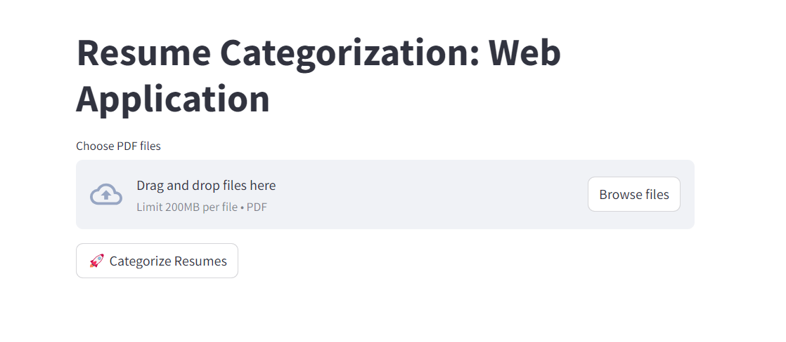

# Resume Categorization WebApp
This is a web-based application built using Streamlit for categorizing resumes into different job roles. The resumes are uploaded as PDF files, and the application uses a pre-trained machine learning model to classify the resumes into specific categories like "Java Developer," "Data Scientist," "HR," etc.

For the "Resume Categorization WebApp" project, the machine learning techniques and algorithms utilized are focused on natural language processing (NLP) and text classification. Here is an overview of the key components:

### 1. **Natural Language Processing (NLP) Techniques:**
   - **Text Preprocessing:** 
     - **Cleaning:** The resumes are cleaned by removing special characters, URLs, and redundant whitespaces. This step ensures that the text is standardized and ready for processing.
     - **Tokenization:** The text is split into individual words or tokens, which are the fundamental units used in the analysis.
     - **Lemmatization/Stemming:** Words are reduced to their base or root form to ensure that different forms of a word (e.g., "running" vs. "run") are treated as the same term.

   - **Vectorization:**
     - **TF-IDF (Term Frequency-Inverse Document Frequency):** This technique is used to convert the cleaned and preprocessed text into numerical vectors. TF-IDF helps in quantifying the importance of each word in a resume relative to its frequency across the entire dataset.

### 2. **Machine Learning Algorithms:**
   - **Support Vector Machine (SVM) with LinearSVC:**
     - **Purpose:** LinearSVC is used for the classification task. It finds the hyperplane that best separates the different categories of resumes based on the TF-IDF features.
     - **Reason for Use:** SVM is particularly effective in high-dimensional spaces, which makes it suitable for text classification tasks where the feature space (vocabulary) can be very large.

   - **Logistic Regression:**
     - **Purpose:** Logistic Regression is used as a baseline model to compare against LinearSVC. It's a simple yet powerful model for binary and multi-class classification problems.

### 3. **Model Training and Evaluation:**
   - The models are trained on a labeled dataset where each resume is categorized into predefined job roles.
   - **Evaluation Metrics:** The models are evaluated using accuracy, precision, recall, and F1-score to ensure they perform well in classifying new resumes.

### 4. **Data Visualization:**
   - **Word Clouds:** Word clouds are generated to visualize the most frequent and significant terms in the resumes. This helps in understanding the key features that influence the classification decisions.

## Features:

- **Resume Upload**: Upload multiple resumes in PDF format.
- **Categorization**: Automatically categorizes resumes into predefined job roles using machine learning.
- **Download Results**: Results are presented in a table and can be downloaded as a CSV file.
- **Simple UI**: Easy-to-use web interface powered by Streamlit.

## Preview of WebApp:

